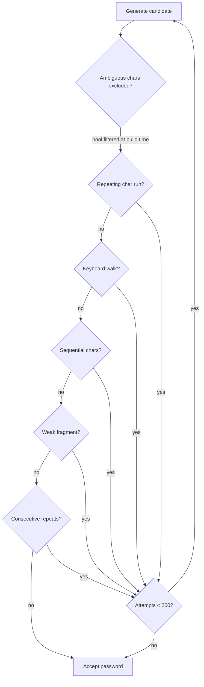

High entropy is necessary but not sufficient for a strong password. A randomly generated string can still contain recognizable patterns — keyboard walks, dictionary words, sequential runs — that substantially reduce the effective search space for a targeted attacker. KeyForge applies five guards after generation to detect and reject these patterns.

## How the guards work together

After the raw password is generated, all five guard functions are evaluated. If any check returns `true` (pattern detected), the password is discarded and a new candidate is generated. This retry loop runs for up to **200 attempts** before falling back to the last candidate. In practice, rejections are rare for well-configured options; the retry cap prevents infinite loops for very restrictive configurations that would otherwise make valid passwords statistically improbable.

The checks short-circuit using `&&` — if an earlier check fails, later checks are skipped, keeping the hot path fast.



## Guard details

<AccordionGroup>

  <Accordion title="1. Exclude ambiguous characters" icon="eye-slash">
    Ambiguous characters are those that are visually indistinguishable in many fonts — for example, the digit `0` and the letter `O`, or lowercase `l` and the digit `1`. Including them increases the risk of transcription errors when reading a password aloud or typing it from a screen.

    This guard is applied at **pool-build time** rather than post-generation. When the option is enabled, the following characters are removed from the pool before any characters are drawn:

    | Character | Confused with |
    |-----------|---------------|
    | `0` | `O` |
    | `O` | `0`, `o` |
    | `o` | `O`, `0` |
    | `l` | `1`, `I` |
    | `1` | `l`, `I` |
    | `I` | `l`, `1` |
    | `\|` | `l`, `I`, `1` |
    | `` ` `` | `'` |
    | `'` | `` ` `` |
    | `"` | `''` |
    | `\` | `/` |

    ```javascript pasgen.js
    const AMBIGUOUS_CHARS = new Set(['0','O','o','l','1','I','|','`','\'','"','\\']);
    ```

    Because exclusion happens at pool construction, it reduces `poolSize` and therefore lowers entropy slightly. See [Entropy explained](/how-it-works/entropy-explained) for the impact.
  </Accordion>

  <Accordion title="2. Block keyboard walks" icon="keyboard">
    A keyboard walk is a sequence of characters that appear adjacent on a physical keyboard layout — for example, `qwe`, `asd`, `zxc`, or `456`. These are among the first patterns attempted in a targeted brute-force or dictionary attack because users frequently choose them as memorable passwords.

    KeyForge checks all four rows of a standard QWERTY keyboard, including both **forward and reverse** traversal, for any run of 3 or more consecutive characters:

    ```javascript pasgen.js
    const KB_ROWS = [
      'qwertyuiop',
      'asdfghjkl',
      'zxcvbnm',
      '1234567890',
    ];

    function hasKeyboardWalk(str, seqLen = 3) {
      const lower = str.toLowerCase();
      for (const row of KB_ROWS) {
        for (let i = 0; i <= lower.length - seqLen; i++) {
          const sub = lower.slice(i, i + seqLen);
          const idx = row.indexOf(sub);
          if (idx !== -1) return true;
          // Reverse walk
          const rev = sub.split('').reverse().join('');
          if (row.indexOf(rev) !== -1) return true;
        }
      }
      return false;
    }
    ```

    The check is case-insensitive — the password is lowercased before comparison, so `QWE`, `qwe`, and `Qwe` are all caught. Reverse walks (`pOi`, `lKj`) are also detected.

    <Note>
      The digit row `1234567890` is checked separately from the sequential character guard. `123` fails both checks; `159` fails neither.
    </Note>
  </Accordion>

  <Accordion title="3. Block sequential characters" icon="arrow-right">
    Sequential characters are runs where each character's ASCII code increases or decreases by exactly 1 — for example, `abc`, `xyz`, `CDE`, `987`, or `fed`. Unlike keyboard walks, this check operates on ASCII codepoints rather than keyboard layout position, so it catches alphabetic and numeric runs independently of their physical key arrangement.

    ```javascript pasgen.js
    function hasSequentialChars(str, seqLen = 3) {
      for (let i = 0; i <= str.length - seqLen; i++) {
        let asc = true, desc = true;
        for (let j = 0; j < seqLen - 1; j++) {
          const diff = str.charCodeAt(i + j + 1) - str.charCodeAt(i + j);
          if (diff !== 1)  asc  = false;
          if (diff !== -1) desc = false;
        }
        if (asc || desc) return true;
      }
      return false;
    }
    ```

    The function checks every window of `seqLen` (default 3) characters. For each window, it verifies whether the sequence is strictly ascending (`diff === 1` for every adjacent pair) or strictly descending (`diff === -1`). If either condition holds, the password is rejected.

    This blocks patterns like `abc`, `XYZ`, `789`, `fed`, `ZYX` regardless of surrounding characters.
  </Accordion>

  <Accordion title="4. Block weak dictionary fragments" icon="book-open">
    Dictionary attacks try known words and common fragments before random strings. A password that happens to contain `password`, `admin`, `qwerty`, or even a partial word like `pass` is significantly more vulnerable than its entropy score suggests, because attackers prioritize these fragments.

    KeyForge maintains a fixed set of common weak fragments (minimum length 4) and rejects any password whose lowercase form contains any of them as a substring:

    ```javascript pasgen.js
    const WEAK_PATTERNS = new Set([
      'pass','word','admin','root','user','login','test','demo',
      'temp','qwer','asdf','zxcv','1234','2345','3456','4567',
      '5678','6789','abcd','aaaa','bbbb','cccc','dddd','eeee',
      'hello','welco','secre','chang','defau','guest','name',
      'email','birth','year','month','date','home','work','love',
    ]);

    function hasWeakFragment(str) {
      const lower = str.toLowerCase();
      for (const frag of WEAK_PATTERNS) {
        if (lower.includes(frag)) return true;
      }
      return false;
    }
    ```

    The check is case-insensitive. A password containing `Admin`, `PASS`, or `Root` is treated identically to one containing `admin`, `pass`, or `root`.

    <Note>
      These fragments are a subset of the most common patterns found in leaked password databases. The list is intentionally conservative — rejecting a valid high-entropy password that incidentally contains `year` is preferable to accepting a vulnerable one.
    </Note>
  </Accordion>

  <Accordion title="5. No consecutive repeats" icon="copy">
    Consecutive identical characters — `aa`, `11`, `!!` — are a simple but effective sign of weak randomness and are among the first substitution patterns tried in a targeted attack. This guard is a strict superset of the repeating-run check: it catches any two adjacent identical characters, regardless of run length.

    ```javascript pasgen.js
    function hasConsecutiveRepeats(str) {
      for (let i = 0; i < str.length - 1; i++) {
        if (str[i] === str[i + 1]) return true;
      }
      return false;
    }
    ```

    The related `hasRepeatingChar` function (with a configurable `maxRun` parameter) is available for contexts where a single repeat is tolerable but longer runs are not. `hasConsecutiveRepeats` enforces the strictest policy: zero tolerance for adjacent duplicates.
  </Accordion>

</AccordionGroup>

## Why these guards matter

A 16-character password with 100 bits of theoretical entropy could still appear in a targeted wordlist if it contains `password` as a substring. The theoretical entropy calculation assumes fully uniform random selection — the guards enforce that assumption in practice by eliminating the subset of outputs that violate it.

<Warning>
  The guards reduce the effective output space, which technically lowers entropy by a small amount. For typical pool sizes and password lengths, rejected outputs represent a negligible fraction of the total space. The security benefit of eliminating recognizable patterns significantly outweighs this reduction.
</Warning>

<Tip>
  If you need a password that passes through a strict policy validator that requires specific character classes, ensure the relevant classes are enabled in KeyForge's options. The retry loop handles the combinatorics — you do not need to generate multiple candidates manually.
</Tip>
